# 🌳 독서의숲

> 책을 읽으면 나무가 자라는 독서 기록 앱

> 📋 **이어서 작업하는 분(사람 · AI)은 먼저 [docs/HANDOFF.md](docs/HANDOFF.md)를 읽어주세요** — 결정 사항 · 배포 · 환경 변수 · 남은 일이 정리되어 있습니다. 다른 PC에서 시작하려면 [다른 PC에서 이어서 작업하기](#-다른-pc에서-이어서-작업하기).

따뜻한 파스텔 자연 팔레트(잔디 초록 · 나무 · 베이지), 동글동글한 폰트, 눌리면 쏙 들어가는 말랑한 입체 버튼, 가벼운 탭 사운드와 진동(앱에서는 항상 켜짐)으로 "책 읽는 숲"을 키워가는 앱입니다. 현재는 **한국 출시 버전**(한국어 UI · 국내 도서 검색)입니다.

<p>
  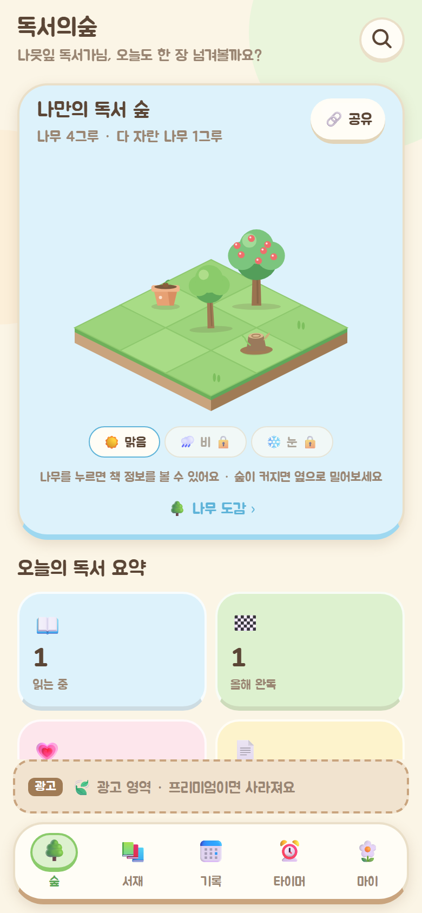
  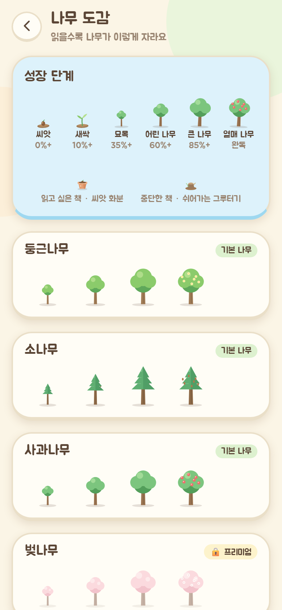
  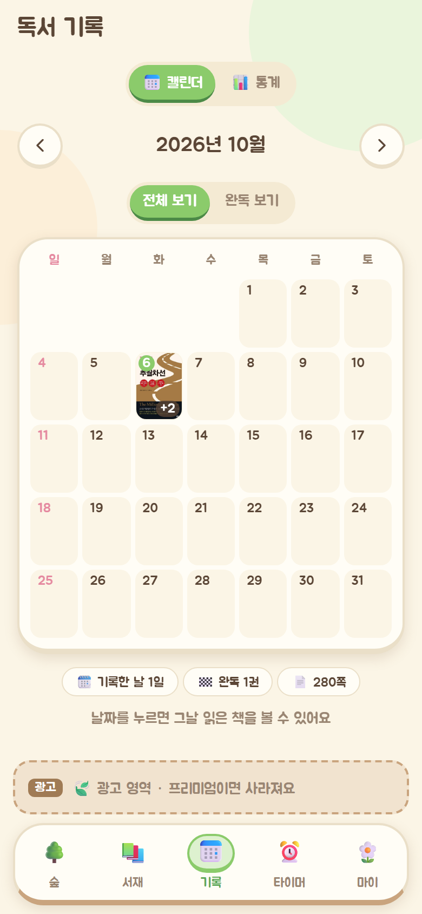
  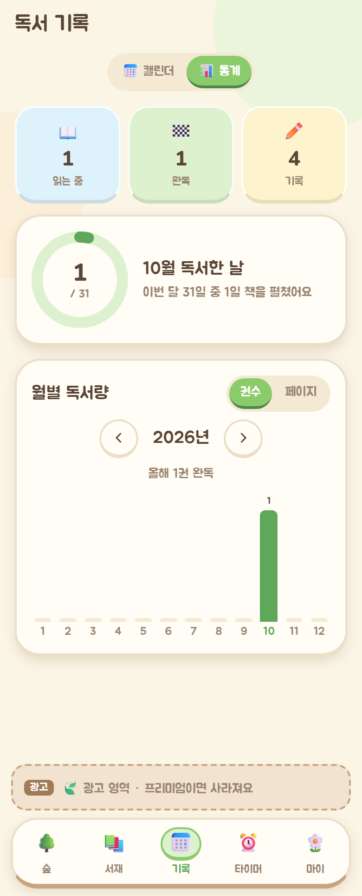
  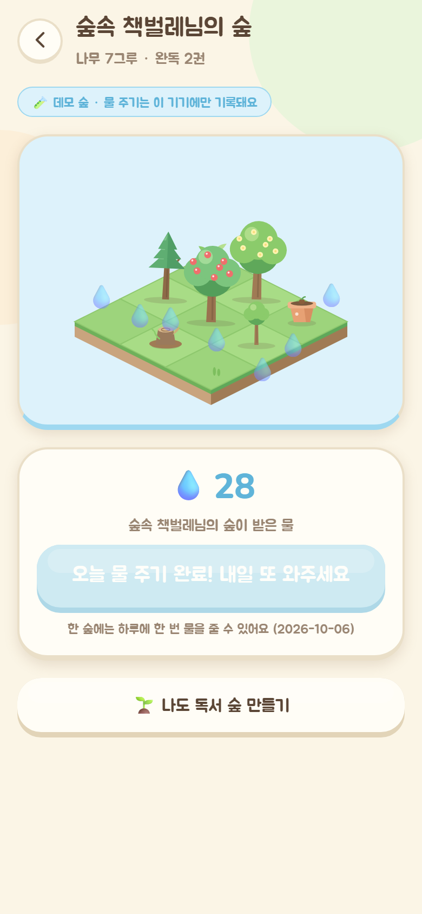
</p>
<p>
  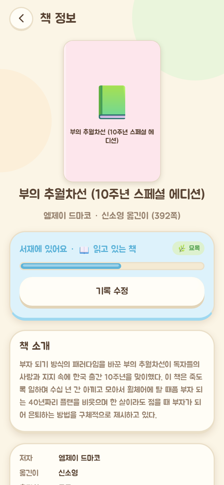
  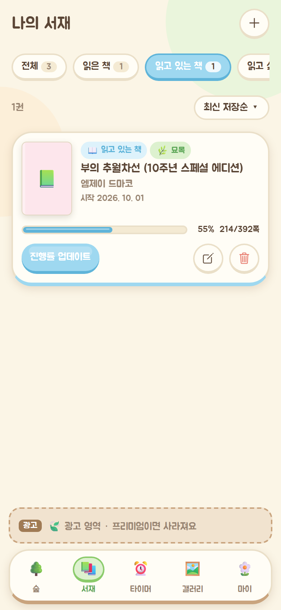
</p>

- **스택**: Expo (SDK 57) · TypeScript · Expo Router · Zustand(persist + AsyncStorage) · TanStack Query · Supabase(Auth/Postgres/Realtime, supabase-js) · i18next + expo-localization · Vercel 서버리스 함수(도서 검색 프록시)
- **플랫폼**: iOS / Android / 웹 (웹은 `npx expo export -p web` → Vercel 호스팅)
- **배포 주소**: https://reading-forest-nine.vercel.app

---

## 💻 다른 PC에서 이어서 작업하기

1. **Cursor 설치**: https://cursor.com 에서 내려받아 설치하고, 기존과 같은 계정으로 로그인합니다.
2. **설정 스크립트 실행** (둘 중 하나)
   - 저장소가 아직 없으면: 시작 메뉴에서 **PowerShell**을 열고 아래 한 줄을 붙여넣은 뒤 Enter
     ```powershell
     iex ((irm https://raw.githubusercontent.com/kysmk1987-lgtm/reading-forest/main/scripts/setup-new-pc.ps1).TrimStart([char]0xFEFF))
     ```
     (`irm … | iex`로 실행해도 되지만, 파일 맨 앞의 UTF-8 표시(BOM) 때문에 빨간 오류 한 줄이 먼저 보일 수 있어요. 위 명령은 그걸 지우고 실행합니다.)
   - 이미 받아 둔 저장소 폴더가 있으면: 폴더 안의 **`새PC설정.bat`을 더블클릭**
   
   스크립트가 Git · Node.js · GitHub CLI를 (없으면) 설치하고, GitHub · Vercel 로그인(브라우저가 열리면 **기존과 같은 계정**으로 승인), 저장소 받기(`문서\GitHub\book`), `npm ci`, Vercel 프로젝트 연결, 개발용 환경 변수(`.env.local`) 받기까지 차례로 해 줍니다. 중간에 멈추면 메시지대로 해결하고 다시 실행하면 이어서 진행돼요.
3. **Cursor에서 폴더 열기**: File → Open Folder → `문서\GitHub\book`. 터미널에서 `npx expo start --web`으로 실행하고, AI에게는 먼저 `docs/HANDOFF.md`를 읽게 하세요.

## 🚀 실행 방법

```powershell
npm install
npx expo start          # QR 코드로 Expo Go 실행, w 키로 웹
npx expo start --web    # 바로 웹으로 실행 (http://localhost:8081)
```

| 명령 | 설명 |
| --- | --- |
| `npm run typecheck` | 앱 + 서버 함수 TypeScript 검사 |
| `npm run test:api` | 도서 검색 함수 오프라인 테스트 (가짜 응답 사용, 키 불필요) |
| `npm run export:web` | 웹 정적 빌드 → `dist/` |
| `npm run generate:sound` | 탭 사운드(`assets/sounds/tap.wav`) 재생성 |

### 로컬 개발에서 도서 검색은 어떻게 동작하나요?
도서 검색은 Vercel 서버리스 함수(`/api/books/*`)를 거칩니다. `npx expo start --web`으로 띄운 개발 서버(8081)에는 이 함수가 없기 때문에:

- **기본값**: 개발 모드와 모바일 앱은 자동으로 **배포된 사이트의 `/api`**(https://reading-forest-nine.vercel.app)를 호출합니다. 별도 설정 없이 검색이 됩니다(배포 환경에 키가 등록되어 있어야 함).
- **함수까지 로컬에서 수정·테스트하려면**: `npx vercel dev`(기본 3000 포트)로 함수를 띄우고 `.env`에 `EXPO_PUBLIC_API_BASE_URL=http://localhost:3000`을 넣은 뒤 `npx expo start --web`을 실행하세요. 키는 `npx vercel env pull .env.local`로 받아올 수 있습니다.

## 🔑 도서 검색 API 키 설정 (필수)

키는 **서버 전용 환경 변수**(이름에 `EXPO_PUBLIC_`이 없음)라 앱 번들에 노출되지 않습니다. 하나 이상 등록하면 되며, **카카오 → (알라딘) → 네이버** 순서로 사용합니다. 키가 하나도 없으면 검색 화면에 "책 검색 준비가 아직 끝나지 않았어요" 안내가 표시됩니다.

| 변수 | 상태 | 용도 | 발급 방법 |
| --- | --- | --- | --- |
| `KAKAO_REST_API_KEY` | ✅ **등록됨** (Production·Preview·Development) | **기본 검색** (제목·저자·출판사·ISBN, 표지, 소개, 정가, 출간일, 옮긴이). **쪽수는 제공하지 않음** | [Kakao Developers](https://developers.kakao.com) 로그인 → 내 애플리케이션 → 애플리케이션 추가 → 앱 키의 **REST API 키** 복사. ⚠️ 키 설정의 **허용 IP(클라이언트 IP) 제한은 켜지 마세요** — Vercel 서버 IP는 고정이 아닙니다 |
| `ALADIN_TTB_KEY` | ⛔ **종료 예정** | 상세 보강 (큰 표지, 쪽수, 분류) | 알라딘 OpenAPI는 신규 키 발급이 2026-09-04에 끝났고 서비스가 **2026-10-30 종료**됩니다. 기존 키가 있다면 그때까지만 동작하며, 없어도 앱은 정상 동작합니다 |
| `NAVER_CLIENT_ID` / `NAVER_CLIENT_SECRET` | 선택 | 예비 검색 | [Naver Developers](https://developers.naver.com/apps) → 애플리케이션 등록 → 사용 API에서 **검색** 선택 → Client ID / Secret 복사 |
| `NL_CERT_KEY` | 권장 | **쪽수 자동 채우기 1순위** (국립중앙도서관 ISBN 서지정보 `PAGE`) | [국립중앙도서관 Open API](https://www.nl.go.kr/NL/contents/N31101030700.do) → 회원가입·로그인 → **인증키 신청**(ISBN 서지정보) → 마이페이지에서 승인된 `cert_key` 복사 |
| `DATA4LIBRARY_KEY` | ✅ **등록됨** (승인 대기 중이면 호출이 실패해도 자동으로 건너뜀) | 베스트셀러 2순위(도서관 인기 대출) + 쪽수 3순위 | [도서관 정보나루](https://www.data4library.kr) → 회원가입·로그인 → 마이페이지 → **인증키 신청**(이용 목적 입력, 승인 후 `authKey` 활성화) |
| `ENABLE_DAUM_PAGES` | 기본 켜짐 | 다음 책 페이지에서 쪽수 읽기 | 끄려면 `false` (아래 주의 참고) |
| `ENABLE_KYOBO_BESTSELLERS` | 기본 켜짐 | 교보문고 베스트셀러 | 끄려면 `false` (아래 주의 참고) |

**쪽수 자동 채우기**: 책 상세(`/api/books/{ISBN}`)는 **다음(Daum) 책 페이지 → 국립중앙도서관 서지정보(`NL_CERT_KEY`) → 도서관 정보나루 상세(`DATA4LIBRARY_KEY`) → 알라딘** 순서로 쪽수를 찾아 채웁니다.
- **다음 책 페이지** (`api/_lib/daum.ts`): 카카오 책 검색 결과의 `url`(예: `https://search.daum.net/search?w=bookpage&bookId=5824679`)을 열어 **페이지수**(+ 사이즈 · 출간일) 칸을 읽습니다. **책 상세를 열 때만** 한 권씩 부르고(검색 결과마다 부르지 않음), 일반 브라우저 User-Agent · 4초 제한시간, 서버 메모리 캐시(최대 500권, 30일) + 쪽수를 찾은 응답은 CDN에 **30일**(`s-maxage`) 보관합니다. 실패하면 조용히 다음 방법으로 넘어가요. 2026-10-07 기준 27권 중 26권(96%)에서 쪽수를 찾았습니다(없던 책: 『흰』).
- 기록 시트의 **현재 진행** 줄에 "전체 N쪽"이 보이고, 쪽수를 못 찾으면 **"쪽수 정보가 없어요 · 직접 입력"** 링크와 % 입력으로 바뀝니다.

**베스트셀러 추천** (`/api/books/bestsellers`, 6시간 캐시 `s-maxage` + `stale-while-revalidate`), 먼저 답하는 곳을 씁니다:
1. **인터넷 교보문고 주간 종합 순위** (`api/_lib/kyobo.ts`): 교보문고 베스트셀러 화면이 쓰는 JSON(`store.kyobobook.co.kr/api/gw/best/best-seller/online`)에서 상위 20권(ISBN = `cmdtCode`)을 가져와 카카오로 소개·옮긴이를 보강합니다.
2. **도서관 정보나루 인기 대출**(최근 30일, `DATA4LIBRARY_KEY`가 활성화된 경우)
3. `src/config/bestsellers.ts`의 **직접 고른 목록**(카카오로 ISBN 확인)

검색 화면에는 공급원과 상관없이 **"독서의숲 베스트셀러"** 제목 + 순위 배지만 보이고, 부제 · 출처 문구는 표시하지 않습니다(2026-10-07 사용자 요청). API 응답의 `source` · `sourceUrl` · 기준일은 그대로 내려옵니다.

> ⚠️ **주의 (스크래핑)**: 다음 책 페이지와 교보문고 JSON은 **공개 API가 아닙니다**. 각 사이트 이용약관에 어긋날 수 있고, 화면 구조가 바뀌면 예고 없이 동작하지 않을 수 있어요(그때는 자동으로 다음 방법으로 넘어가며 앱은 계속 동작). 호출을 최소화하도록 캐시를 길게 두었고, 문제가 생기거나 요청을 받으면 Vercel 환경 변수 `ENABLE_DAUM_PAGES=false` / `ENABLE_KYOBO_BESTSELLERS=false`를 넣고 재배포해서 바로 끌 수 있습니다. 파서는 `scripts/fixtures/`의 저장된 HTML/JSON으로 테스트합니다(`npm run test:scrapers`).

Vercel에 등록 (`--value`로 넘기면 프롬프트 없이 등록되고 줄바꿈도 섞이지 않습니다):

```powershell
npx vercel env add KAKAO_REST_API_KEY production --value "<키>" --sensitive --yes
npx vercel env add KAKAO_REST_API_KEY preview --value "<키>" --sensitive --yes
npx vercel env add NAVER_CLIENT_ID production --value "<ID>" --sensitive --yes          # 선택
npx vercel env add NAVER_CLIENT_SECRET production --value "<SECRET>" --sensitive --yes  # 선택
npx vercel env add NL_CERT_KEY production --value "<cert_key>" --sensitive --yes        # 쪽수
npx vercel env add DATA4LIBRARY_KEY production --value "<authKey>" --sensitive --yes    # 베스트셀러 + 쪽수
npx vercel --prod --yes                                                                  # 재배포해야 적용됩니다
```

> 대시보드(Project → Settings → Environment Variables)에서 등록해도 됩니다. 로컬 `vercel dev`용 키는 `.env.local`(git 제외)에 둡니다.

### API 엔드포인트

| 경로 | 설명 |
| --- | --- |
| `GET /api/books/search?q=검색어&field=keyword\|title\|author\|publisher\|isbn` | 국내 도서 검색. 응답 `{ books, source }`, 10분 캐시 |
| `GET /api/books/{ISBN}` | 상세 정보 (카카오 + 네이버 병합, 쪽수는 다음 책 페이지 → 국립중앙도서관 → 정보나루 → 알라딘 순서로 보강: 표지, 소개, 저자/옮긴이, 정가, 서점 링크), 1일 캐시(쪽수가 있으면 30일) |
| `GET /api/books/bestsellers` | 베스트셀러 추천 `{ books, source: 'kyobo' \| 'data4library' \| 'curated', periodStart?, periodEnd?, sourceUrl? }`, 6시간 캐시 |

오류 응답은 `{ error: { code, message } }` 형식이며 `code`는 `NO_KEYS`, `BAD_REQUEST`, `NOT_FOUND`, `RATE_LIMITED`, `UPSTREAM` 중 하나입니다. 앱은 코드별로 한국어 안내를 보여줍니다.

## ⚙️ 그 밖의 환경 변수

`.env.example`을 `.env`로 복사해서 사용합니다.

| 변수 | 기본값 | 설명 |
| --- | --- | --- |
| `EXPO_PUBLIC_ENABLED_LOCALES` | `ko` | 활성 언어 목록(쉼표 구분) |
| `EXPO_PUBLIC_BOOK_REGION` | `KR` | 도서 검색 지역 |
| `EXPO_PUBLIC_API_BASE_URL` | (자동) | `/api` 서버 주소 |
| `EXPO_PUBLIC_MAP_SCOPE` | `KR` | 함께 읽기 지도 범위 (`KR` 한국 지도, `GLOBAL` 세계 지도 자리 표시) |
| `EXPO_PUBLIC_SUPABASE_URL` | 없음 | Supabase 프로젝트 주소 (`https://<project-ref>.supabase.co`) |
| `EXPO_PUBLIC_SUPABASE_ANON_KEY` | 없음 | Supabase anon(publishable) 키. RLS로 보호되므로 앱에 들어가도 안전. 두 값이 없으면 **로컬 게스트 모드**(이 기기에만 저장, 데모 숲) |

> ⚠️ `service_role`/secret 키와 DB 비밀번호는 절대 앱·저장소에 넣지 마세요(RLS를 우회합니다).

## 🗄️ 백엔드: Supabase 연결하기

로그인(익명·카카오·구글), 서재/독서 로그 동기화, 공개 숲 + 물 주기, (3차) 실시간 접속자·응원·테마 독서실은 **Supabase**(Postgres + Auth + Realtime)를 씁니다. 연결하지 않아도 앱은 로컬 모드로 모두 동작합니다.

### 1) 프로젝트 만들기
1. [supabase.com](https://supabase.com) → **New project** → Region: **Northeast Asia (Seoul)** → DB 비밀번호는 안전한 곳에 보관
2. **Project Settings → API**(또는 상단 **Connect**)에서 **Project URL**과 **anon / publishable 키**를 복사

### 2) 데이터베이스 만들기 (마이그레이션)
- **간단한 방법**: 대시보드 **SQL Editor → New query**에 저장소의 **`supabase/setup.sql`** 내용을 통째로 붙여넣고 **Run**
  - 이미 `setup.sql`(0001~0002)을 실행한 프로젝트는 새로 추가된 마이그레이션만 담긴 **`supabase/setup_0003.sql`**(4차: 문장 갤러리)만 실행하면 됩니다.
  - 0003까지 실행한 프로젝트는 **`supabase/setup_0004.sql`**(나무 옮겨심기 위치 + 책 리뷰)만 실행하면 됩니다. 실행 전에도 앱은 동작하며, 리뷰 탭은 "준비 중" 안내와 내 기록만 보여주고 나무 위치는 이 기기에만 저장됩니다.
  - `setup*.sql`은 `npm run build:sql`이 `supabase/migrations/`에서 자동으로 만듭니다(직접 고치지 마세요).
- **CLI**: `npx supabase login` → `npx supabase link --project-ref <project-ref>` → `npx supabase db push` (`supabase/migrations/*.sql` 순서대로 적용)

만들어지는 것:
| 테이블 | 내용 | 접근 규칙(RLS) |
| --- | --- | --- |
| `profiles` | 닉네임, `is_premium` | 본인만 조회, 닉네임만 수정 가능(`is_premium`은 앱에서 못 바꿈). 가입 시 트리거로 자동 생성 |
| `books` | ISBN-13 기준 책 정보 캐시 | 누구나 조회, 로그인 사용자는 없는 책만 추가 |
| `user_books` | 내 서재(상태·진행률·별점·한줄평·날짜·나무 종류) | 본인만 읽기/쓰기 |
| `reading_logs` | 날짜별 독서 기록(읽은 쪽수, 3차부터 집중 시간) | 본인만 |
| `forests` | 공개 숲(`share_slug`, `is_public`) | 공개된 숲은 누구나 조회, 주인만 수정 |
| `waterings` | 물 주기 | 로그인(익명 포함) 사용자가 공개 숲에 추가. `unique(forest_id, visitor_id, watered_on)` → **하루 한 번** |
| `quote_cards` (4차) | 문장 카드(책·문장·디자인·위치 %, 좋아요/스크랩/댓글 수) | 직접 조회는 **작성자만**. 다른 사람은 `gallery_feed()` RPC로만 봄(블러 처리) |
| `card_likes` · `card_scraps` · `card_comments` · `card_reports` · `card_reveals` | 좋아요 · 스크랩 · 댓글 · 신고 · 스포일러 펼침 기록 | 본인 것만 쓰기, 볼 수 있는 카드에만 좋아요/댓글. 신고 3회 → 자동 숨김 |
| Storage `cards`(비공개) · `cards-blur`(공개) | 카드 원본 PNG · 아주 작게 흐린 썸네일 | 업로드는 `내 uid/` 폴더에만. 원본은 **볼 수 있는 사람만** 서명 URL 발급 |
| `book_reviews` (6차) | 책 리뷰(ISBN · 별점 0.5 단위 · 500자 · 닉네임), 사람당 책 하나에 하나 | 직접 조회·삭제는 **본인만**. 작성은 `upsert_book_review()`, 다른 사람 리뷰는 `book_review_summary()` · `book_reviews_feed()` RPC로만 봄 |
| `book_review_reports` (6차) | 리뷰 신고 | 남의 리뷰만 신고, 3번 신고되면 자동 숨김 |
| `user_books.garden_x/garden_y` (6차) | 숲에서 나무가 심긴 칸(0~11, 0006 적용 후 0~999) | `user_books`와 같음 |

- `get_public_forest(slug)` RPC: 공개 숲 페이지용(나무·물 준 횟수만, 한줄평/별점은 노출 안 함)
- `monthly_reading_stats` 뷰: 월별 독서한 날·쪽수·완독 수 (통계/독서 결산용)

### 3) 로그인 설정 (Authentication)
앱은 열면 **로그인 화면부터** 보여줍니다(카카오 · 구글 · 이메일+비밀번호). 아래 설정이 없는 로그인 방법은 버튼을 눌렀을 때 "준비 중" 안내가 나옵니다.
1. **Authentication → Sign In / Providers → Anonymous sign-ins** 켜기 (로그인하지 않은 방문자가 공유받은 숲에 물을 줄 때 사용)
   - **Email** 공급자 켜기(기본 켜짐). **Confirm email**은 켜도 꺼도 됩니다 — 켜면 가입 후 "인증 메일을 보냈어요" 화면이 나오고, 끄면 바로 로그인됩니다. 기본 메일 발송은 시간당 몇 통으로 제한되므로 실제 운영에서는 **SMTP 설정**(Authentication → Emails)을 권장합니다.
   - (권장) **Minimum password length** 8, **Password requirements**: 영문 + 숫자 — 앱에서도 같은 규칙으로 검사합니다.
2. **카카오 로그인**
   - [Kakao Developers](https://developers.kakao.com) → 내 애플리케이션 → 앱 추가(이미 도서 검색용 앱이 있으면 그대로 사용 가능)
   - **카카오 로그인 → 활성화 ON**
   - **Redirect URI**: `https://<project-ref>.supabase.co/auth/v1/callback`
   - **동의항목**: 닉네임(`profile_nickname`), 프로필 사진(`profile_image`) 설정. Supabase는 이메일(`account_email`)도 요청하므로, 이메일 동의항목을 켤 수 없다면(비즈 앱 전환 필요) Supabase의 Kakao 설정에서 **Allow users without an email**을 켜세요
   - **보안 → Client Secret 코드 생성 → 활성화**
   - Supabase **Authentication → Providers → Kakao**: Enable, **Client ID = 카카오 REST API 키**, **Client Secret = 위에서 만든 코드** → Save
3. **구글 로그인(선택)**: Google Cloud Console에서 OAuth 클라이언트(웹) 생성 → 승인된 리디렉션 URI에 `https://<project-ref>.supabase.co/auth/v1/callback` → Supabase Providers → Google에 Client ID/Secret 입력
4. **Authentication → URL Configuration**
   - **Site URL**: `https://reading-forest-nine.vercel.app`
   - **Redirect URLs**: `https://reading-forest-nine.vercel.app/**`, `http://localhost:8081/**`, `readingforest://**`, (Vercel 미리보기 주소를 쓰려면) `https://*-kysmk1987-8120s-projects.vercel.app/**`
   - 앱이 쓰는 주소: OAuth · 가입 인증 메일 → `/auth/callback`, 비밀번호 재설정 메일 → `/auth/reset` (위 `/**` 패턴에 포함됨)

### 4) 앱에 연결
Vercel → Project → Settings → Environment Variables(Production/Preview/Development)와 로컬 `.env.local`에 `EXPO_PUBLIC_SUPABASE_URL`, `EXPO_PUBLIC_SUPABASE_ANON_KEY`를 넣고 다시 배포합니다.

### 동작 방식
- **로그인 화면 먼저(로그인 게이트)**: 루트 레이아웃의 `Stack.Protected`가 로그인하지 않았거나 익명 세션뿐이면 `(auth)` 화면(`/login` · `/signup` · `/forgot-password`)만 열어 줍니다. 공유 숲(`/forest/…`), `/auth/callback`, `/auth/reset`은 로그인 없이 열립니다. Supabase 환경 변수가 없으면(로컬 모드) 게이트 없이 바로 앱이 열리고, `EXPO_PUBLIC_AUTH_GATE=false`로 개발 중 게이트를 끌 수 있습니다(예전처럼 익명 세션으로 사용).
- **이 기기 기록 → 계정 연결**: 게스트/익명으로 쓰던 이 기기의 서재·독서 로그는 처음 로그인(또는 가입)한 계정으로 업로드되어 서버의 기록과 합쳐집니다(같은 책은 최근 수정본 우선). 이후 변경은 바로바로 서버에 저장(write-through), 다른 기기에서 로그인하면 내려받습니다. **다른 계정**이 같은 기기에서 로그인하면 이전 계정의 기기 사본은 지우고(서버에는 남아 있음) 새 계정 기록을 내려받습니다(`profiles` 스토어의 `dataOwner`).
- **카카오/구글 로그인**: 웹은 카카오 페이지로 이동했다가 `/auth/callback`으로 돌아옵니다. 앱(iOS/Android)은 인앱 브라우저(expo-web-browser) + `readingforest://auth/callback` 딥링크로 처리합니다. 누르기 전에 `/auth/v1/settings`로 공급자가 켜져 있는지 확인해서, 꺼져 있으면 Supabase 오류 페이지 대신 "준비 중" 안내를 보여줍니다.
- **이메일 가입**: 이메일 · 닉네임(2~16자) · 비밀번호(영문+숫자 8자 이상) · 확인 + 필수 동의 2개(서비스 이용약관 · 개인정보 수집 및 이용, **문서는 초안** `src/features/auth/legal.ts`). 닉네임과 동의 시각 · 문서 버전은 `user_metadata`에 저장되고, 닉네임은 기존 트리거가 `profiles.nickname`에 넣습니다(별도 마이그레이션 없음).
- **아이디 저장 · 자동 로그인**: 이 기기에만 저장(`rf-auth-prefs`). 자동 로그인을 끄면 앱/브라우저 탭을 새로 열 때 로그인 화면이 나옵니다.
- **공개 숲**: 홈의 **공유** → 서재를 동기화하고 `forests`에 공개 → `/forest/{share_slug}` 링크 공유(Web Share → 복사, 앱은 공유 시트).
- **물 주기**: 방문자는 익명 로그인으로 `waterings`에 한 줄 추가. 같은 날 두 번째는 unique 제약으로 거절됩니다(한국 시간 기준 날짜).

## 🌏 나중에 해외 언어·해외 도서를 켜는 방법

언어와 지역 설정은 `src/config/locale.ts` 한 곳에 모여 있습니다.

1. **번역 파일 추가**: `src/lib/i18n/locales/`에 `ko.ts`와 같은 구조로 파일을 만듭니다(예: `ja.ts`). `en.ts`는 이미 준비되어 있고 현재는 비활성 상태입니다. `TranslationResources` 타입 덕분에 빠진 키가 있으면 타입 검사에서 바로 알려줍니다.
2. **등록**: `src/config/locale.ts`의 `SUPPORTED_LOCALES`, `LOCALE_LABELS`와 `src/lib/i18n/index.ts`의 `ALL_RESOURCES`에 새 언어를 추가합니다.
3. **활성화**: 환경 변수 `EXPO_PUBLIC_ENABLED_LOCALES=ko,en,ja`를 설정하고 다시 빌드합니다. 활성 언어가 2개 이상이 되면 **마이 → 설정에 언어 선택이 자동으로 나타납니다.** 기기 언어가 활성 목록에 있으면 그 언어로 시작합니다.
4. **해외 도서 검색**: `EXPO_PUBLIC_BOOK_REGION=GLOBAL`로 바꾸면 `src/lib/api/global/`의 Google Books → Open Library 검색을 사용합니다(국내 프록시 대신). 지역별 서버 프로바이더가 필요해지면 `api/_lib/providers.ts`에 추가하세요.

## 🗂️ 폴더 구조

```
api/                        # Vercel 서버리스 함수 (도서 검색 프록시, 키는 서버에만 존재)
├─ books/search.ts          # GET /api/books/search
├─ books/[isbn].ts          # GET /api/books/{ISBN}
├─ books/bestsellers.ts     # GET /api/books/bestsellers
└─ _lib/                    # providers(카카오·알라딘·네이버), daum(책 페이지 쪽수), kyobo(베스트셀러),
                            #   pages(국립중앙도서관·정보나루 쪽수/인기 대출), 병합, ISBN, 캐시
src/
├─ app/                     # Expo Router 라우트 (파일 = 화면)
│  ├─ _layout.tsx           # 폰트·QueryClient·Auth 리스너·Stack, 웹에서는 모바일 폭(480px)으로 중앙 정렬
│  ├─ (tabs)/               # 하단 탭: 숲(index) · 서재 · 기록(records: 캘린더·통계) · 함께 읽기(together) · 마이
│  │  └─ gallery.tsx        # 문장 갤러리 피드 (최신/인기/스크랩/내 카드, 책 필터) — 숨김 탭(href: null)이라 탭바·광고가 그대로 보임, 주소는 /gallery
│  ├─ room/[id].tsx         # 테마 독서실 (일러스트 + 같은 방 독서가 + 미니 타이머)
│  ├─ search.tsx            # 책 검색 (입력창 하나: 제목/저자/출판사, ISBN을 넣어도 검색) + 베스트셀러 추천
│  ├─ book/[id].tsx         # 책 상세 + 서재 담기 + 책 소개 | 리뷰 탭
│  ├─ forest/[userId].tsx   # 공개 숲 페이지 (읽기 전용 + 물 주기), /forest/demo = 데모 숲
│  ├─ trees.tsx             # 나무 도감 (종류별 성장 단계)
│  ├─ card/new.tsx          # 문구 카드 만들기 (템플릿 · 글꼴 · 비율 · 저장/공유/올리기)
│  ├─ card/[id].tsx         # 카드 상세 (스포일러 펼치기 · 좋아요 · 스크랩 · 댓글 · 신고)
│  └─ wrapped.tsx           # 독서 DNA 결산 (스토리 슬라이드 · 페르소나 · 요약 카드 내보내기)
├─ config/                  # locale.ts(언어·지역), app.ts(API 주소)
├─ components/
│  ├─ ui/                   # 디자인 시스템: Button(말랑 입체), Card, Chip, ProgressBar, Input, StarRating,
│  │                        #   Screen, Sheet(바텀시트), SegmentedControl, DateField(.web), EmptyState, IconButton
│  ├─ ForestTabBar.tsx      # 나무 판자 느낌의 커스텀 탭바 (+ 광고 자리)
│  └─ BannerAdPlaceholder.tsx · BookCover.tsx · GrowthBadge.tsx(작은 나무 그림)
├─ features/
│  ├─ auth/                 # 로그인 게이트: useAuth(세션 리스너 · 카카오/구글/이메일 로그인) · authStore(게이트 상태 · 아이디 저장/자동 로그인) · validation · legal(약관 초안) · AuthUI
│  ├─ books/                # 검색/상세 쿼리 훅(상세 정보로 서재 기록 자동 보강), 검색 결과 아이템
│  ├─ forest/               # TreeGraphic(SVG 나무), AnimatedTree(흔들림·성장 애니메이션), ForestGarden(아이소메트릭 숲·옮겨 심기),
│  │                        #   layout(칸 배치·이동·교환), DirtBurst(흙 애니메이션), species(나무 종류 목록), GrowthCelebration,
│  │                        #   SpeciesSheet, 날씨, 공유/물 주기(publicForest, demo)
│  ├─ reviews/              # 리뷰 집계(aggregate), Supabase API(api), 리뷰 탭(ReviewsPanel)
│  ├─ records/              # 독서 캘린더, 통계, 집계 함수
│  ├─ together/             # 타이머, 한국 지도(Presence·응원), 테마 독서실, 지역(regions), 알림
│  ├─ sound/                # 백색소음 목록, 믹서 엔진(.web = Web Audio), 볼륨 슬라이더
│  ├─ gallery/              # 카드 템플릿·글꼴, QuoteCardView, 캡처(.web = html-to-image),
│  │                        #   스마트 블러 규칙(blur.ts), Supabase API(api.ts), 번역 스텁(translate.ts)
│  ├─ wrapped/              # 결산 집계(compute.ts), 페르소나 규칙(personas.ts), 샘플 데이터, 일러스트, 요약 카드
│  └─ library/              # 기록 시트(4가지 상태), 서재 카드, 진행률 시트, 정렬, 성장 단계, 독서 로그, Supabase 동기화(cloudSync + syncMapping)
├─ lib/
│  ├─ api/books.ts          # 지역별 검색 클라이언트 (KR → /api 프록시)
│  ├─ api/global/           # 해외용 Google Books · Open Library (BOOK_REGION=GLOBAL일 때만)
│  ├─ i18n/                 # i18next 초기화 + locales/ko.ts(활성), en.ts(비활성)
│  ├─ supabase.ts · feedback.ts(사운드+햅틱) · sfx.ts(앱: 미리 만든 expo-audio 플레이어) · sfx.web.ts(웹: Web Audio + 미리 디코딩) · entitlements.ts(무료/프리미엄)
│  └─ confirm.ts · date.ts · storage.ts · queryClient.ts
├─ stores/                  # Zustand: library(+독서 로그), profile, settings, bookCache, forest(날씨·물 주기), celebration
├─ theme/                   # colors · typography · spacing(radius) · shadows
└─ types/                   # Book, LibraryEntry, ReadingStatus ...
scripts/test-book-api.ts    # 도서 API 오프라인 테스트
supabase/migrations/        # DB 스키마 + RLS (0001_init.sql …), setup.sql = 전부 합친 붙여넣기용 파일
scripts/test-sync-mapping.ts # 서재 ⇄ Supabase 행 변환 오프라인 테스트
scripts/test-gallery-wrapped.ts # 블러 규칙 · 쪽→% · 번역 한도 · 결산 집계/페르소나 테스트 (npm test)
scripts/test-garden-reviews.ts # 숲 칸 배치·이동·교환 · 리뷰 집계 · 쪽수 파싱/대체 테스트 (npm test)
scripts/test-scrapers.ts    # 다음 책 페이지 · 교보문고 베스트셀러 파서 테스트 (fixtures/ 저장본 사용, npm test)
vercel.json                 # 빌드 설정, /api 제외 SPA 리라이트, 함수 설정
```

## ✅ 6차 기능 — 나무 옮겨 심기 · 프리미엄 나무 · 책 리뷰 · 베스트셀러

<p>
  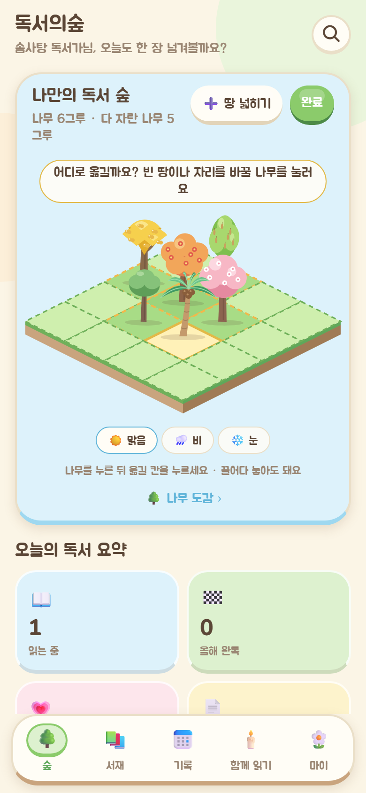
  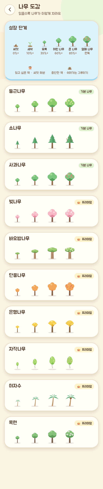
  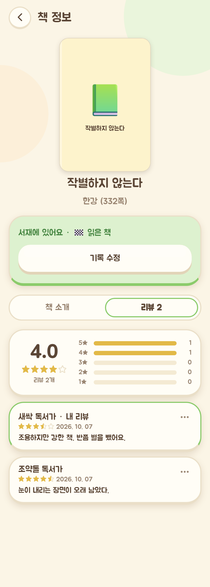
  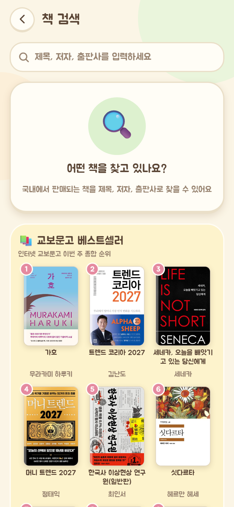
  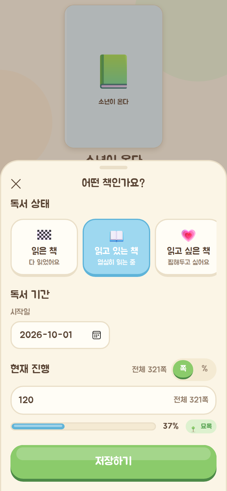
  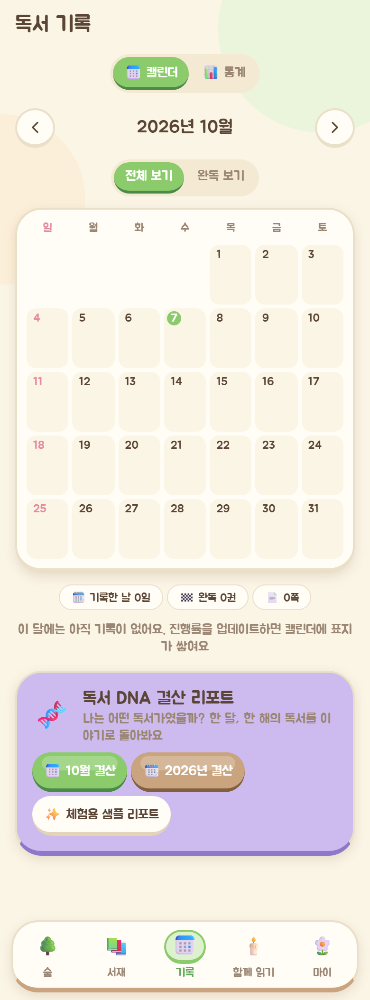
</p>

- **나무 옮겨 심기** (홈 숲 → 🪴 옮겨 심기): 나무를 누르고 빈 칸을 누르면 이동, 다른 나무를 누르면 자리 교환, 끌어다 놓아도 돼요. 옮길 수 있는 칸이 점선으로 보이고 흙·삽 애니메이션과 "푹" 소리가 납니다. **➕ 땅 넓히기**로 빈 칸을 제한 없이 늘릴 수 있고, 숲이 카드보다 커지면 끌어서 상하좌우로 둘러봐요. 위치는 이 기기(서재 스토어 버전 2)와 `user_books.garden_x/garden_y`에 저장되고 공개 숲 페이지도 같은 배치로 보여요. 위치가 없는 나무는 예전처럼 가운데부터 채워집니다.
- **프리미엄 나무 7종**: 은행나무(부채꼴 노란 잎 · 은행), 자작나무(흰 줄기 · 꽃차례), 야자수(휜 줄기 · 코코넛), 목련(큰 꽃) 추가. 모든 성장 단계에 고유한 모양이 있고, 도감에 👑 프리미엄 배지가 붙어요. 종류 목록은 `features/forest/species.ts`의 데이터 하나로 관리합니다.
- **책 리뷰** (책 상세 → 책 소개 | 리뷰 탭): 평균 · 개수 · 별점 분포, 닉네임 · 별점 · 날짜 · 내용 목록, 더보기 메뉴(내 리뷰는 수정/삭제, 남의 리뷰는 신고), 반 별점 + 500자. 기록 시트의 별점·한줄평은 마이의 **한줄평 공개 범위**(기본 전체 공개)에 따라 자동으로 리뷰에 올라가요. Supabase가 없으면 내 기록만 보여줍니다.
- **검색**: ISBN 탭과 바코드 버튼을 없애고 입력창 하나로 통일(ISBN을 넣으면 알아서 ISBN 검색). 검색 전 화면에 **베스트셀러 추천** 그리드.
- **쪽수**: 전체 쪽수 입력칸을 없애고 서버에서 자동으로 채웁니다(위 "쪽수 자동 채우기" 참고).
- **그 밖에**: 사진 글자 인식(OCR)과 tesseract.js · expo-image-picker 제거, 홈·마이의 갤러리 버튼 가운데 정렬, 기록 탭의 독서 DNA 배너를 캘린더 아래로, 진동 설정 제거(앱에서는 항상 켜짐, 설정 스토어 버전 1).

## ✅ 4차 기능 — 문장 카드 · 갤러리 · 스마트 블러

<p>
  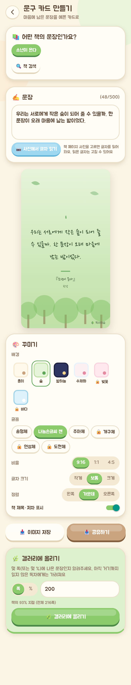
  
  
  
</p>

**갤러리 위치 (탭 5개 유지)**: 탭은 숲 · 서재 · 기록 · 함께 읽기 · 마이 그대로 두고, **숲(홈)에 "✍️ 문장 갤러리" 카드**(카드 만들기 / 갤러리 구경)를 넣었습니다. 카드 만들기는 책을 읽다가 바로 하는 행동이라 첫 화면에서 한 번에 닿아야 하고, 기록·함께 읽기는 이미 꽉 찬 탭이라 6번째 탭을 만드는 대신 이렇게 했어요. **마이**에는 내 스크랩 · 내 카드 바로가기와 "읽지 않은 책의 문구도 가리기" 설정이 있습니다.

- **문구 카드 메이커** (`app/card/new.tsx`)
  - 서재에서 책 고르기(없으면 책 검색으로 이동), 문장 직접 입력(500자).
  - 꾸미기: 템플릿 6종(종이 · 숲 · 밤하늘 · 수채화 무료, 벚꽃 · 바다 프리미엄🔒), 글꼴 6종(송명체 · 나눔손글씨 펜 · 주아체 무료, 개구체 · 연성체 · 도현체 프리미엄🔒), 글자 크기 S/M/L, 정렬, 책 제목·저자 표시, 작은 "🌳 독서의숲" 워터마크. 비율 **9:16 · 1:1 · 4:5**.
  - **이미지 저장/공유**: 웹은 html-to-image로 1080px PNG를 만들고 글꼴을 base64로 넣어서 굽습니다. 공유는 Web Share(파일) → 안 되면 다운로드. 앱은 react-native-view-shot + expo-sharing / expo-media-library(사진첩 저장).
  - 글꼴은 모두 [Google Fonts](https://fonts.google.com/)의 SIL Open Font License(OFL) 글꼴이고, 처음 고를 때만 불러옵니다.
- **문장 갤러리** (`app/(tabs)/gallery.tsx`, `app/card/[id].tsx`): 최신/인기(좋아요 + 스크랩×2 + 댓글) 피드, 책별 필터, 카드 상세에서 좋아요 · 스크랩 · 댓글(삭제는 내 것만) · 신고(내 피드에서 바로 숨김, 3번 신고되면 모두에게 숨김) · 내 카드 삭제.
- **스마트 블러 (스포일러 방지)**
  - 카드를 올릴 때 **문장 위치**(쪽 또는 %)를 꼭 받아요. 쪽은 전체 쪽수로 %로 바꿉니다(전체 쪽수를 모르면 %로 입력).
  - 내 진도가 카드 위치보다 낮으면 흐리게 + "아직 읽지 않은 부분이에요 (60% 지점)". **그래도 볼래요** → 확인 후 펼치기.
  - 서재에 없는 책은 그대로 보이고, 마이의 **"읽지 않은 책의 문구도 가리기"**(기본 꺼짐)를 켜면 가려져요.
  - **새지 않게 서버에서 처리**: `gallery_feed()`(security definer)가 가려야 할 카드는 `quote`와 원본 경로를 **null**로 주고, 흐린 썸네일 경로만 줍니다. 원본은 `reveal_card()`를 불러야 받을 수 있고, 이때 `card_reveals`에 기록돼요. `quote_cards` 테이블은 작성자만 직접 읽을 수 있고, 비공개 `cards` 버킷은 `card_object_visible()`을 통과한 사람만 서명 URL을 받을 수 있어요. 흐린 썸네일은 216px로 미리 흐리게 만든 JPEG라 글자를 읽을 수 없습니다.
  - 알아둘 점: 이미 받은 서명 URL은 1시간 동안 유효하고, 내 진도는 서재 동기화 기준이라 오프라인으로 바꾼 진도는 동기화된 뒤에 반영돼요.
- **번역**: 이번 단계에서는 외부 번역 API를 부르지 않습니다. `EXPO_PUBLIC_TRANSLATION_ENABLED`(기본 꺼짐) 플래그, 스텁 서비스(`features/gallery/translate.ts`), 무료 **하루 10회** 한도 훅만 준비했어요. 켜려면 서버 함수(`/api/translate`, 키는 서버에만)를 만들어 `translateText`에 연결하면 됩니다.

## ✅ 5차 기능 (일부) — 독서 DNA 결산 리포트

<p>
  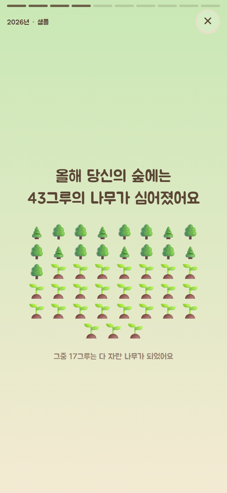
  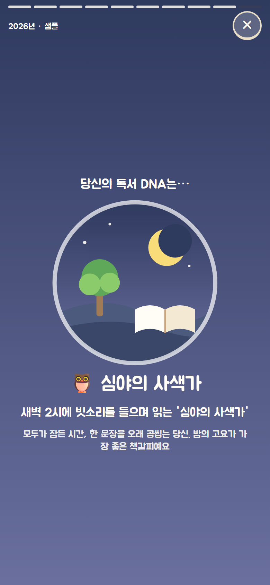
  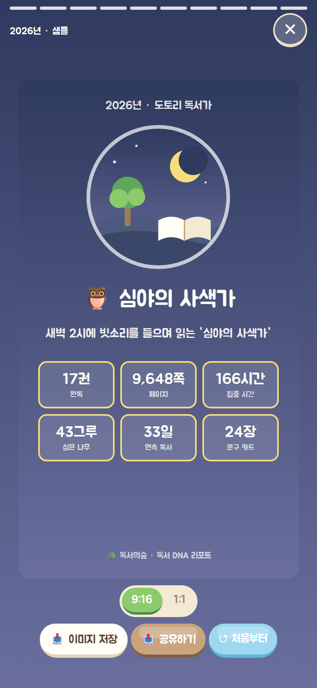
</p>

- **어디서**: 기록 탭 캘린더 아래 배너(이번 달 결산 · 올해 결산 · 체험용 샘플 리포트), 숲(홈)에는 **매달 25일 이후와 12월**에만 배너가 나타나요.
- **스토리 슬라이드** (`app/wrapped.tsx`): 화면을 누르거나 옆으로 밀어 넘기는 전체 화면 슬라이드, 상단 진행 막대, 숫자가 올라가는 애니메이션. 완독 권수 · 넘긴 페이지 · 집중 시간 · **"올해 당신의 숲에는 42그루의 나무가 심어졌어요"** · 가장 길게 이어 읽은 날 · 가장 많이 읽은 시간 · 가장 많이 들은 소리/독서실 · 가장 많이 읽은 분야(정보가 있을 때만) · 별점 1위 책 · 만든 문구 카드 수.
- **소리 기록**: 타이머가 끝날 때 재생 중이던 백색소음과 독서실을 기록합니다(`timerStore.history`, 책이 연결되면 `reading_logs.sounds/room`도 저장).
- **페르소나 8종** (`features/wrapped/personas.ts`): 심야의 사색가 · 새벽의 산책자 · 완독 마라토너 · 몰입의 잠수부 · 문장 수집가 · 꾸준한 정원사 · 햇살 아래 산책자 · 새싹 탐험가. 규칙을 순서대로 확인하고(연간은 기준을 크게 잡음), 각각 색과 SVG 일러스트가 있어요. 예: "새벽 2시에 빗소리를 들으며 읽는 '심야의 사색가'".
- **요약 카드**: 9:16 / 1:1로 저장 · 공유(카드 메이커와 같은 캡처 방식). 기존 요금제 게이팅(`readingWrappedExport`)을 그대로 따라 **프리미엄**에서 열리며, 마이 → 프리미엄 미리보기(개발용)로 시험할 수 있어요.
- 기록이 없으면 친절한 빈 화면 + **체험용 샘플 리포트** 버튼.

## ✅ 3차 기능 — 함께 읽기

<p>
  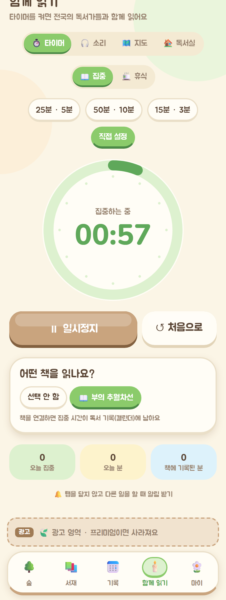
  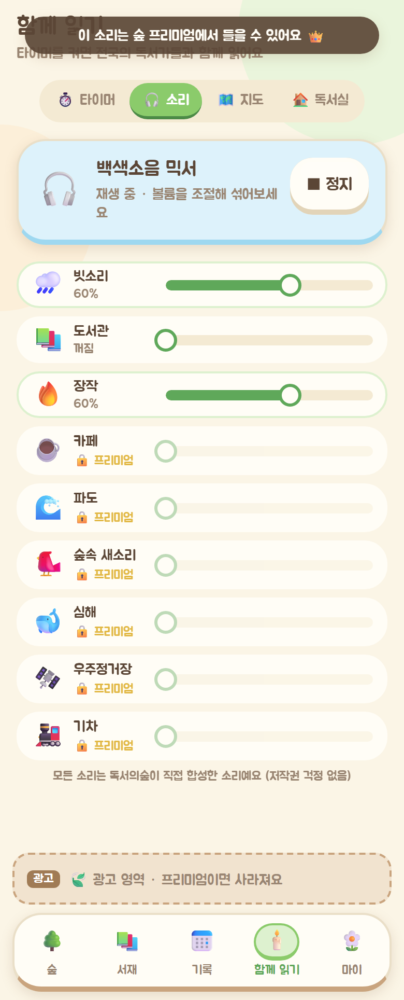
  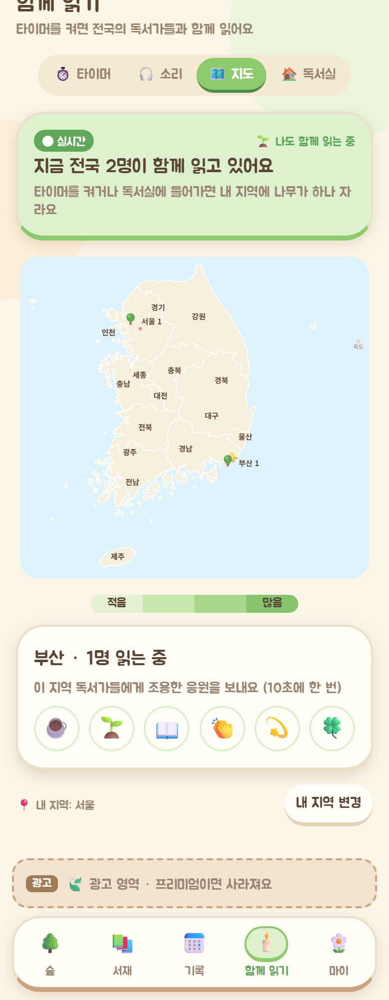
  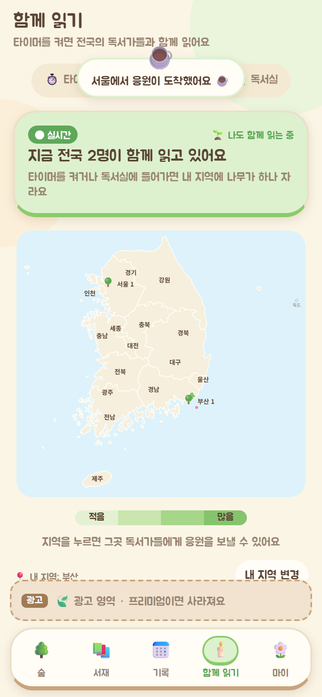
  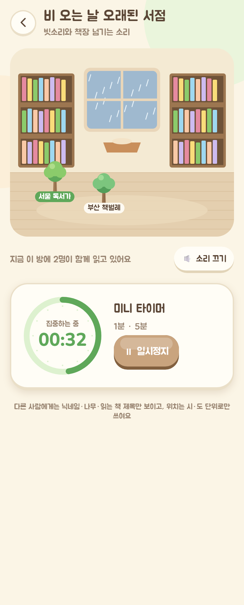
</p>

**탭 구조 (5개 유지)**: 숲 · 서재 · 기록 · **함께 읽기**(기존 타이머 탭) · 마이. 함께 읽기 안에 ⏱️ 타이머 / 🎧 소리 / 🗺️ 지도 / 🏠 독서실 4개 구역이 있고, 독서실에 들어가면 전용 화면(`/room/{id}`)이 열립니다. 내 지역 설정은 **마이 → 📍 내 지역**에 있습니다.

- **뽀모도로 타이머** (`features/together/TimerPanel`, `stores/timerStore`, `TimerWatcher`)
  - 프리셋 25/5 · 50/10 · 15/3 + 직접 설정, 큰 원형 타이머, 시작/일시정지/처음으로, 집중 ↔ 휴식 전환.
  - 끝나는 시각(timestamp) 기준으로 계산하므로 백그라운드·새로고침에도 정확합니다.
  - 끝나면 차임 + 진동, 앱은 **로컬 알림**(expo-notifications, 시작할 때 예약), 웹은 선택 시 브라우저 알림.
  - 읽고 있는 책을 연결하면 집중 시간이 `reading_logs`(kind `focus`, `minutes`)에 기록되고 캘린더에 남습니다. 끝나면 **읽은 쪽수 업데이트**를 바로 권합니다.
- **백색소음 믹서** (`features/sound/`)
  - 소리마다 볼륨 슬라이더, 여러 소리 동시 재생. 무료: 빗소리 · 도서관 · 장작 / 프리미엄(잠금): 카페 · 파도 · 숲속 새소리 · 심해 · 우주정거장 · 기차.
  - 웹은 Web Audio API(끊김 없는 루프, 첫 탭에서 시작), 앱은 expo-audio 루프 재생.
- **실시간 한국 지도** (`features/together/KoreaLiveMap`, `PresenceBridge`, `presence.ts`)
  - 17개 시·도 SVG 지도(제주·울릉·독도 포함), 지역마다 나무 아이콘 + 인원, 인원이 많을수록 진한 초록. 상단에 "지금 전국 ○○명이 함께 읽고 있어요".
  - **Supabase Realtime Presence**, 채널 `reading-now`. 타이머가 돌고 있거나 독서실에 있을 때만 집계됩니다. 보내는 정보는 시·도, 상태, 방(+독서실 안에서는 닉네임·나무·책 제목)뿐이에요.
  - 지역은 `/api/geo`(Vercel의 `x-vercel-ip-country-region` 헤더 → 시·도, 위치 권한 불필요)로 자동 감지하고, **마이 → 내 지역**에서 바꿀 수 있습니다.
  - Supabase가 연결되지 않으면 예시 인원을 보여주는 **체험 모드**로 표시됩니다.
  - `EXPO_PUBLIC_MAP_SCOPE=KR | GLOBAL` (`src/config/locale.ts`). GLOBAL은 세계 지도(3D 지구본) 자리 표시 화면입니다.
- **조용한 응원**: 지도의 지역을 누르고 이모지를 보내면(Realtime Broadcast) 그 지역 독서가들에게 "서울에서 응원이 도착했어요 ☕" 말풍선이 떠오릅니다. 10초에 한 번 제한.
- **테마 독서실** (`features/together/rooms.ts`, `RoomScene`, `app/room/[id].tsx`)
  - 비 오는 날 오래된 서점 · 심야 도서관(무료), 고요한 찻집 · 바닷가 다락방(프리미엄 잠금).
  - 일러스트 배경, 들어가면 그 방의 소리 조합이 자동 재생(입장 탭이 사용자 동작이라 웹에서도 재생됨), 같은 방 사람들이 닉네임 표시와 함께 나무로 서 있고, 미니 타이머가 있습니다.

### 소리 · 지도 출처와 라이선스
- **소리**: 외부 음원을 쓰지 않았습니다. `scripts/generate-ambient.mjs`(백색소음 9종)와 `scripts/generate-tap-sound.mjs`(탭·성장·물·차임)가 노이즈·사인파·필터로 직접 합성한 WAV(16 kHz, 루프 경계 크로스페이드, 합계 약 3 MB)라서 저작권 제약이 없습니다(프로젝트 자체 제작, CC0처럼 자유롭게 사용 가능).
- **지도**: [Natural Earth](https://www.naturalearthdata.com/) Admin-1 경계(퍼블릭 도메인)를 `scripts/generate-korea-map.mjs`로 단순화해 `src/features/together/koreaMapData.ts`에 넣었습니다.

## ✅ 2차 기능 — 독서 숲

- **하단 탭 5개 (재구성)**: 숲 · 서재 · **기록**(새로 추가: 캘린더·통계) · 타이머 · 마이. 갤러리는 탭에서 빠지고 **마이 → 문장 갤러리 카드**로 들어갑니다(아직 "곧 만나요").
- **나무 성장 그래픽** (react-native-svg, 웹·앱 공통): 씨앗(0%) → 새싹(10%) → 묘목(35%) → 어린 나무(60%) → 큰 나무(85%) → 완독 시 **열매 나무**(열매/꽃). 은은한 흔들림 애니메이션, 단계가 오르면 **"나무가 자랐어요!"** 성장 애니메이션 + 효과음 + 진동. 서재·홈의 이모지 단계 아이콘도 작은 나무 그림으로 교체.
- **나만의 독서 숲** (홈): 아이소메트릭(2.5D) 잔디 타일 정원. 읽는 중/완독 = 나무, 중단 = 그루터기, 읽고 싶은 책 = 씨앗 화분. 책이 늘면 정원이 넓어지고(3×3 → 4×4 → …) 옆으로 밀어서 볼 수 있어요. 나무를 누르면 표지·제목·진행률 말풍선 → 책 상세로 이동.
- **나무 종류**: 무료 3종(둥근나무·소나무·사과나무, 책마다 자동 배정 + 말풍선의 **나무 바꾸기**), 프리미엄 7종(벚나무·바오밥나무·단풍나무 + 6차의 은행나무·자작나무·야자수·목련)과 **숲 날씨(비·눈)** 는 잠금 표시(`entitlements` 모듈, 마이 → 프리미엄 미리보기(개발용) 스위치로 테스트). **나무 도감**(`/trees`)에서 종류별 성장 단계를 볼 수 있어요.
- **독서 캘린더**: 월별 달력, 기록이 있는 날엔 책 표지 썸네일(+n), 전체 보기/완독 보기, 이전/다음 달, 날짜를 누르면 그날 읽은 책 목록.
- **통계**: 읽는 중·완독·기록 수, 이번 달 독서한 날 링, 월별 독서량(권수/페이지 전환, 연도 선택).
- **독서 로그**: 책 추가·진행률 업데이트·완독 때마다 `(날짜, 책, 읽은 쪽수)` 기록이 자동 저장됩니다. 기존 서재 데이터는 업데이트 시 시작일/완독일 기준으로 로그가 자동 생성됩니다(스토어 버전 1 마이그레이션).
- **물 주기(응원)**: 공개 숲 페이지 `/forest/{id}` (읽기 전용 숲 + **물 주기 💧** 버튼, 물방울 애니메이션 + 횟수, 하루 한 번).
  - **서버 미연결(로컬 모드)**: 공유 버튼을 누르면 "서버 연결 후 공개 공유 가능" 안내와 함께 **내 숲 미리보기**, **데모 숲(`/forest/demo`)** 둘러보기, 데모 링크 복사를 제공합니다. 물 주기는 이 기기에만 기록됩니다.
  - **Supabase 연결 후**: 내 숲을 공개하고 `/forest/{slug}` 링크를 공유, 방문자 물 주기는 DB unique 제약으로 하루 한 번 제한.

## ✅ 1차 기능

- **하단 탭 5개**: 숲, 서재, 타이머(디자인된 "곧 만나요" 카드), 마이(프로필·닉네임·요금제 배지·프리미엄 카드·설정)
- **국내 도서 검색**: 제목/저자/출판사(ISBN을 넣어도 됨), 표지·제목·저자·출판사·출간일 표시, 이미 담은 책은 상태 배지
- **책 상세**: 큰 표지, 책 소개, 저자/옮긴이, 출판사, 출간일, 쪽수, ISBN, 정가, 분류, 서점 링크
- **기록 바텀시트** (상태별 입력 항목)
  - 읽은 책: 시작/종료일 · 별점 · 한줄평(500자)
  - 읽고 있는 책: 시작일 · 현재 진행(쪽 ↔ % 전환, 옆에 "전체 N쪽", 쪽수를 모르면 직접 입력 링크) · 성장 단계 미리보기
  - 읽고 싶은 책: 기대지수(하트) · 기대평
  - 중단한 책: 시작/중단일 · 별점 · 한줄평
- **서재**: 상태별 탭 + 개수, 정렬(최신 저장순/오래된 저장순/최근 수정순/제목순/평점순), 진행률 바(% · 현재/전체 쪽), 수정·삭제, 진행률 빠른 업데이트(100% 도달 시 자동 완독 처리)
- **인증**: Supabase 설정 시 로그인 화면 먼저(카카오 · 구글 · 이메일+비밀번호, 회원가입 · 비밀번호 찾기) + 서재 동기화, 미설정 시 로컬 게스트 프로필
- **요금제 게이팅**: `entitlements` 모듈(`isPremium`, 기본 무료) + 무료 사용자에게만 하단 광고 자리 표시

## 🗺️ 로드맵

| 단계 | 내용 |
| --- | --- |
| **1차** | 기반 + 기본 독서기록 ✅ |
| **2차** | 독서 숲 — 성장 그래픽, 아이소메트릭 숲, 캘린더/통계, 물주기 ✅ (백엔드 Firebase → Supabase 전환) |
| **3차** | 뽀모도로 · 백색소음 · 실시간 한국 지도(Presence) · 조용한 응원 · 테마 독서실 ✅ (세계 지도/3D 지구본은 `MAP_SCOPE=GLOBAL` 자리만 준비) |
| **4차** | 문장 카드 · 갤러리(댓글·스크랩·좋아요·신고) · 스마트 블러 ✅ (번역은 `TRANSLATION_ENABLED` 플래그·하루 10회 한도만 준비) |
| **5차** | 독서 DNA 결산(월간·연간, 페르소나, 공유 카드) ✅ · 인앱 결제(RevenueCat)/광고(AdMob) · 출시 ⏳ |
| **6차** | 나무 옮겨 심기 · 프리미엄 나무 7종 · 책 리뷰 · 베스트셀러 추천 · 쪽수 자동 채우기 ✅ |

## ☁️ 배포 (Vercel)

`vercel.json`이 빌드 명령(`npx expo export -p web`), 출력 폴더(`dist`), `/api`를 제외한 SPA 리라이트(나머지 경로 → `/index.html`)를 지정합니다. `api/` 폴더는 자동으로 서버리스 함수가 됩니다.

```powershell
npx vercel --prod --yes     # 수동 배포
npx vercel git connect      # GitHub 저장소 연결 → push 시 자동 배포
```
